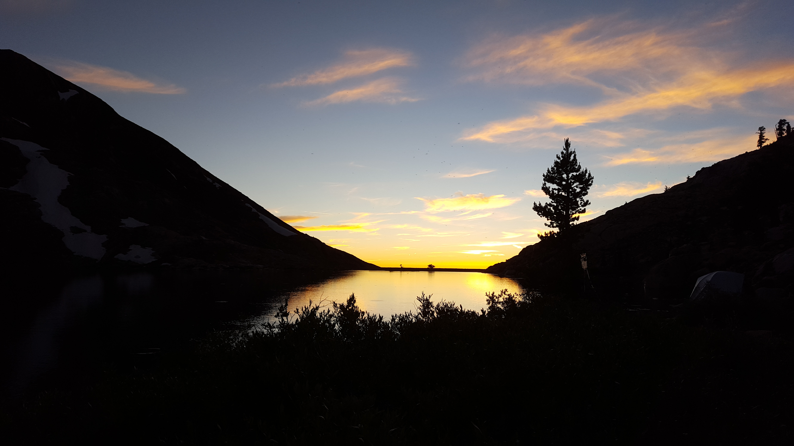

# About Me
###### Hey! I'm Logan, a software engineering student at the Oregon Institute of Technology with a strong interest in technological advancement and using modern technology in new, innovative ways. I have experience in aerospace as a three-time intern at NASA and a previous project that went on the International Space Station! In an entirely different galaxy, I'm also interested in financial technology and how it can drastically impact the average person's life and financial wellbeing. Overall, I always strive to work on meaningful projects and pride myself on having a plethora of "real" work experience in comparison to my peers. 

###### Oh, and I occasionally hike.

**Sunset somewhere in the Sierra Nevadas, 2016**

<!-- <link rel="stylesheet" href="https://maxst.icons8.com/vue-static/landings/line-awesome/font-awesome-line-awesome/css/all.min.css"> -->
<i class="las la-battery-three-quarters"></i>
<i class="lab la-linux"></i>

## Technologies and Development Skills:

[//]: # (Comment: These are from the above YAML(?))